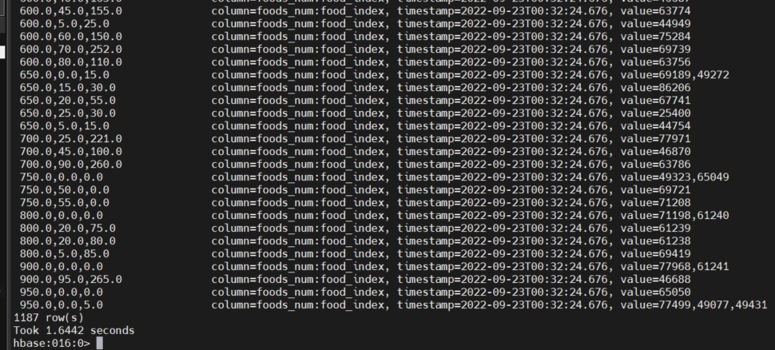

# HBase Mapreduce 연결
- HBase에 들어있는 데이터를 이용하여 Mapreduce 연산 후
- HBase의 또 다른 테이블에 연산 결과 저장
- 에러로 인해 서버를 재시작 할 때마다 [error handling guide](../HBASE/error_handling.md)에 따라 데이터를 삭제하고 다시 세팅해야 함

## 데이터 전처리
- 식품영양DB(new) api에서 받은 데이터를 사용
- food_nutrition_DB_total.json을 
    - 식품영양DB(new)_분석.ipynb 를 이용하여

- food_nutritioni_DB_for_mapred.txt로 변환
    - 식품 num, 탄, 단, 지 저장됨
    - NaN 있는 값은 제거하고 저장
    - 식품영양DB_영양소분포_분석.ipynb를 이용하여

- food_nutrition_DB_without_alias.csv로 변환
    - 식품 num, 탄, 단, 지 저장됨
    - 탄수화물 1000 이하, 단백질 100 이하 지방 400 이하만 포함되도록 자름

## HBase 세팅
[HBase README](../HBASE/README.md) 참고
- 특히 class path 설정을 잘 해줘야 함
- 세팅 후 필요한 테이블 생성
```
hbase > create 'nutrition_DB', 'nutrition'
hbase > create 'food_recommend', 'foods_num'
```

## HBase에 값 넣기
- `food_nutrition_DB_without_alias.csv`를 `~/data`로 옮기기
- 기본 shell(hbase shell 아님!!)에서 `$HBASE_HOME/bin/hbase org.apache.hadoop.hbase.mapreduce.ImportTsv -Dimporttsv.separator="," -Dimporttsv.columns="HBASE_ROW_KEY,nutrition:carbon,nutrition:protein,nutrition:fat" nutrition_DB ~/data/food_nutrition_DB_without_alias.csv` 입력
    - csv 파일을 hbase nutrition_DB에 넣는 작업

## MapReduce 파일 작성
- `./src/FoodperNutiritionHBase.java` 를 `~/Project/src`로 옮기기
- `./src/Driver.java` 또한 옮김
- `build.xml` 파일은 `~/Project/`에 옮기기

## java 파일 컴파일
- `~/Project`에서 `ant` 입력하여 컴파일

## MapReduce 실행
- HBase, Hadoop이 실행되어 있어야 하는 상태
    - start-all.sh, $HBASE_HOME/bin/start-hbase.sh 순서로 실행
- `~/Project`에서 `hadoop jar ease.jar foodpernutrition` 입력하여 hadoop mapreduce 실행

## 결과



- get 실행 시 잘 작동 됨
- 총 1187 row 존재

## 참조
- [TableMapper, TableReducer 참조](https://sujee.net/2011/04/10/hbase-map-reduce-example/)
- [apache Put API document](https://hbase.apache.org/apidocs/org/apache/hadoop/hbase/client/Put.html)
    - hbase.client.Put cannot find error 해결
- [apache mapreduce example document](http://devdoc.net/bigdata/hbase-0.98.7-hadoop1/book/mapreduce.example.html)
    - 코드 작성 시 참조
- HBase 완벽 가이드(라스 조지 저)
    - 코드 작성 시 참조